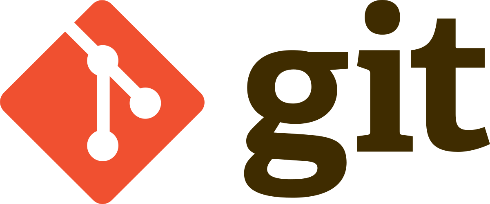
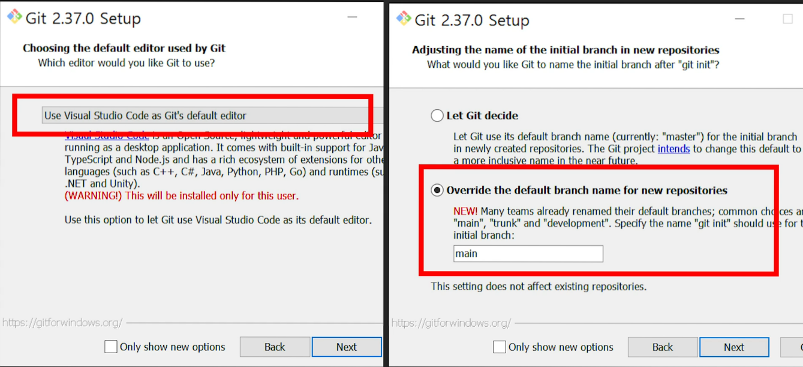
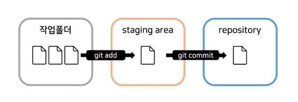
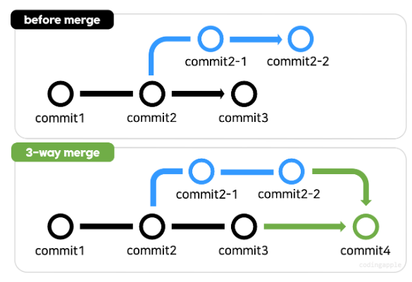
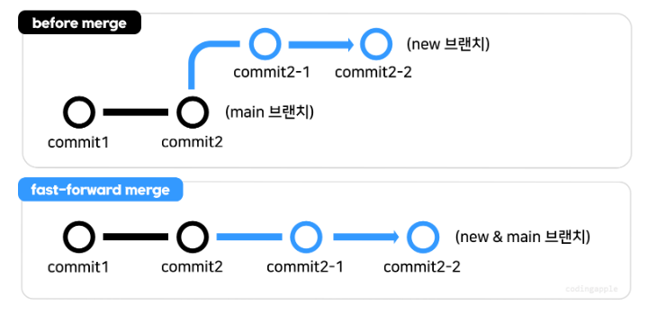
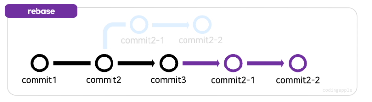
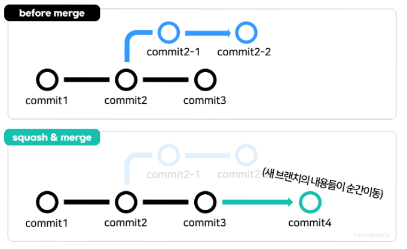
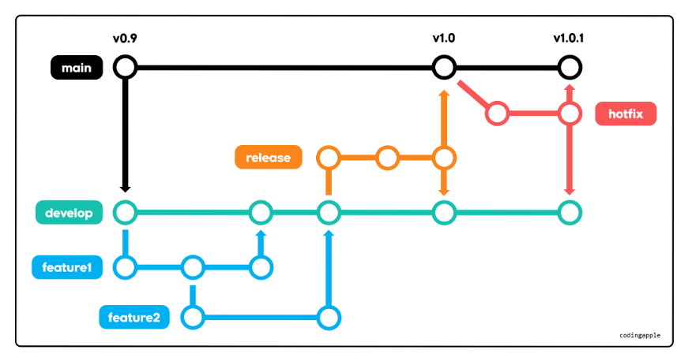
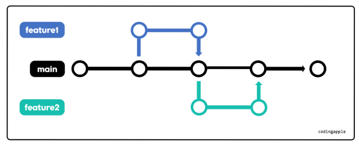

<div align="center">
    
    <h3>
        <b> Git </b>
    </h3>
    <p>
        <b> 분산형 버전 관리 시스템(VCS) Git의 사용 방법과 컨벤션에 관하여 정리한 문서입니다. </b>
    </p>
</div>


# 📜 Index
### <a href="#indexInstall">📥 설치</a>
### <a href="#indexCommit">🔝 Commit</a>
### <a href="#indexBranch">🔛 Branch</a>
### <a href="#indexMerge">🔃 Merge</a>
### <a href="#indexRestore">↩ Restore, Revert, Reset</a>
### <a href="#indexPush">📤 Push</a>
### <a href="#indexGitignore">⛔ .gitignore</a>
### <a href="#indexGitWay">📚 Git 방법론</a>
### <a href="#indexGitStash">✉ Git Stash</a>


# 📥 설치<a id="indexInstall"></a>
> Git을 설치하는 방법을 설명합니다.

[<<git 사이트>>](https://git-scm.com/)에 방문하여 설치 프로그램을 다운받아 실행합니다.

<div align="center">

</div>

설치 프로그램 설치 시 위 두 가지 사항을 주의하여 체크하고 설치합니다.


# 🔝 Commit<a id="indexCommit"></a>
> commit은 프로젝트 내에서 의미있는 변경 사항들을 저장소에 기록하는 역할을 합니다.

<div align="center">

</div>

Git은 위와 같은 과정을 통해 commit 과정을 진행하여 순서는 다음과 같습니다.

1. ```git add ~파일명1~ ~파일명2~``` - 변경된 사항들을 스테이징합니다.

2. ```git commit -m '~commit내용,메시지~'``` 스테이징된 파일들을 commit합니다.

```git status``` 명령어를 통해 현재 스테이징된 내용을 확인할 수 있습니다.

```git log``` 명령어를 통해 commit한 기록들을 볼 수 있습니다.

### 📑 커밋 메시지 컨벤션

```git
~타입~: ~제목~

~본문내용~

~바닥글~
```

기본적으로 위와 같은 구조를 따르며 규칙은 아래와 같습니다.

1. 제목과 본문은 빈 행으로 구분합니다.

1. 제목은 50글자 이내로 제한합니다.

1. 제목의 첫글자는 대문자로 작성합니다.

1. 제목 끝에는 마침표를 넣지 않습니다.

1. 제목은 명령문으로 사용하며 과거형으로 작성하지 않습니다.

1. 본문의 각 행은 72글자 이내로 제한합니다.

1. '어떻게'보다는 '무엇'과 '왜'로 설명하는 것을 지향합니다.

타입의 내용은 아래 중 하나를 사용합니다.

* Feat - 새로운 기능에 대한 커밋입니다.

* Fix - 버그 수정에 대한 커밋입니다.

* Build - 빌드 관련 파일 수정 / 모듈 설치 또는 삭제에 대한 커밋입니다.

* Chore - 그 외 자잘한 수정에 대한 커밋입니다.

* CI - ci 관련 설정 수정에 대한 커밋입니다.

* Docs - 문서 수정에 대한 커밋입니다.

* Style - 코드 스타일 혹은 포맷 등에 관한 커밋입니다.

* Refactor - 코드 리팩터링에 대한 커밋입니다.

* Test - 테스트 코드 수정에 대한 커밋입니다.

* Perf - 성능 개선에 대한 커밋입니다.

제목의 내용은 커밋에 관한 내용을 규칙을 따라 간략히 작성합니다.

본문의 내용은 제목에서 표현할 수 없는 상세한 내용을 작성합니다.

바닥글의 내용은 어떤 이슈에서 왔는지와 같은 참조 정보들을 작성합니다.

```git
git commit -m "fix: Safari에서 모달을 띄웠을 때 스크롤 이슈 수정

모바일 사파리에서 Carousel 모달을 띄웠을 때,
모달 밖의 상하 스크롤이 움직이는 이슈 수정.

resolves: #1137
```

위의 내용은 커밋 메시지의 예시입니다.


# 🔛 Branch<a id="indexBranch"></a>
> branch는 작업 공간을 여러 갈래로 복제시켜 따로 관리합니다. 후에 merge로 다시 합칠 수 있습니다.

```git branch ~브랜치이름~``` 명령어를 통해 새로운 branch를 생성합니다.

```git switch ~브랜치이름~``` 명령어을 통해 생성한 branch 작업 공간으로 이동합니다.


# 🔃 Merge<a id="indexMerge"></a>
> Merge는 branch로 나누어 놓은 작업 공간들을 다시 합치는 작업을 말합니다.

우선 ```git switch main``` 명령어를 통해 main branch로 이동합니다.

```git merge ~브랜치이름~``` 명령어를 통해 해당 branch를 main branch와 merge 시킵니다.

merge 시 두 branch가 공통으로 가지고 있는 파일의 내용이 둘이 다르다면 conflict가 발생합니다. 따라서 이 부분을 통일시켜 conflict를 해결하고 merge시켜야 합니다.

merge를 수행한 이후에 자동으로 branch는 사라지지 않습니다. ```git branch -d ~브랜치이름~```을통해 직접 제거해야합니다. -D 옵션을 준다면 merge되지 않은 branch도 강제로 제거할 수 있습니다.

원격 저장소에서는 pull request를 통해 공동 작업자에게 merge를 요청할 수 있습니다.

### 🎫 Merge의 종류

<div align="center">

</div>

3 way merge - 흔히 일반적으로 수행하는 merge 방법입니다.

<div align="center">

</div>

fast-foward - main branch에서 따로 commit된 내용이 없다면 생성한 branch를 main branch로 취급하여 merge를 수행하는 방식입니다.

<div align="center">

</div>

rebase and merge - main branch에서 이미 commit된 내용이 있음에도 불구하고 생성한 branch의 시작점을 main branch의 commit한 내용까지 옮겨서 fast-forward를 수행하는 방법입니다.

* 이 방법을 수행하려면 생성한 branch로 이동한 후 ```git rebase main``` 명령어를 통해 rebase(branch의 시작점 이동)합니다. 그 후, main branch로 이동한 다음 merge를 수행하면 됩니다.

<div align="center">

</div>

squash & merge - branch에 자잘한 commit 내용이 너무 많을 경우, squash & merge를 통해 해결할 수 있습니다. 생성한 branch의 commit 내용을 한 개의 commit 내용으로 압축시키고, main branch에 merge 시킵니다.


# ↩ Restore, Revert, Reset<a id="indexRestore"></a>
> Git은 버전 관리 프로그램이기 때문에 실수한다면 이전 버전으로 되돌릴 수 있습니다.

### 💾 Git Restore
파일 하나만 잘못되었을 경우에는 ```git restore ~파일명~``` 명령어를 통해 그 파일 하나만 이전 commit 버전으로 복구할 수 있습니다.

```git restore --source ~commit아이디~ ~파일명~``` 명령어처럼 옵션을 통해 특정 commit으로 복구할 수 있습니다.

```git restore --staged ~파일명~``` 명령어로 옵션을 통해 특정 파일의 Staging을 취소할 수 있습니다.


### 📦 Git Revert
```git revert ~commit아이디~``` 명령어로 작업 디렉토리에서 발생한 일들 중 특정 commit에서 변경된 사항을 없애버릴 수 있습니다.

```git revert HEAD``` 명령어는 가장 최근의 commit을 revert합니다.


### 🔄 Git Reset
```git reset ~옵션~ ~commit아이디~``` 명령어를 통해 특정 commit으로 돌아갈 수 있습니다. 옵션 값에 따라 사라질 파일들을 어떻게 처리할지 결정합니다.

```--hard``` 옵션은 사라질 파일들을 전부 삭제합니다.

```--soft``` 옵션은 사라질 파일들을 남기고 해당 commit 부분의 파일들만 Staging Area에 Staging됩니다.

```--mixed``` 옵션은 ```--soft``` 옵션과 같은 방식으로 동작하지만 해당 commit 부분의 파일들을 Staging하지 않습니다.


# 📤 Push<a id="indexPush"></a>
> Push는 자신이 로컬저장소에 commit한 사항들을 원격저장소에 반영하는 작업입니다.

```git push ~원격저장소주소~ main``` 명령어로 원격저장소에 main branch로 push합니다. 원격저장주소는 .git으로 끝납니다.

```git remote add ~이름~ ~원격저장주소~``` 명령어로 긴 원격저장주소를 이름으로 대체할 수 있습니다. ```git remote -v``` 명령어로 변수 목록을 확인할 수 있습니다.

push한 내용은 ```git clone ~원격저장주소~``` 명령어로 clone해올 수 있습니다.

push를 하기 위해서는 원격저장소의 가장 최신 내용과 로컬저장소의 내용이 같아야 합니다. 따라서 내용이 다를 경우에는 ```git pull ~원격저장주소~``` 명령어를 통해 로컬 저장소의 내용을 최신화한 후에 push를 해야합니다.

pull은 fetch와 merge를 수행하는 작업입니다. fetch는 원격저장소의 commit들 중에 로컬 저장소에 없는 신규 commit을 가져오는 작업입니다.


# ⛔ .gitignore<a id="indexGitignore"></a>
> .gitignore 파일은 push 또는 commit 하지 않을 내용들을 포함합니다.

git repository를 기준으로 경로가 시작됩니다.

파일 이름 또는 경로명(절대경로명)을 적어 ignore할 파일들을 선정합니다.


# 📚 Git 방법론<a id="indexGitWay"></a>
> Git을 활용하는 대표적인 전략들을 소개합니다. 크게 Git Flow와 Trunk-Based로 나누어 설명합니다.

### 🏗 Git Flow
<div align="center">

</div>

안정적인 개발을 할 때 사용합니다. 크게 다음과 같은 방식으로 운영됩니다.

main branch - 현재 프로젝트가 존재하는 기반 branch입니다.

develop branch - 새로운 버전으로 개발할 때 main branch를 복제하여 개발용으로 사용하는 branch입니다.

feature branch - develop branch에서 새로운 기능을 개발할 때 추가하는 branch입니다.

release branch - develop branch에서 새로운 버전이 완성되면 새로 release branch로 나누어 운영 test를 합니다. 오류 사항들을 수정하고 main branch에 merge합니다.

hotfix branch - release branch에서 발견하지 못한 오류들이 발생할경우 긴급한 수정할 때 사용합니다.


### 🧱 Trunk-Based
<div align="center">

</div>

main branch 하나로 유지하며 운영합니다. 크게 업데이트를 하지 않는 안정적인 프로젝트에 적합합니다.

기능 추가나 오류 수정이 필요하면 main branch에서 feature branch를 나누어 개발하고, 완성되면 다시 main branch에 merge합니다.


# ✉ Git Stash<a id="indexGitStash"></a>
> 코드를 잠깐 없애고 싶을 때 임시 저장소로 보낼 수 있습니다.

```git stash``` 명령어를 입력하면 최근 commit 사항과 비교하여 변경된 부분은 전부 임시 저장소에 저장합니다. 하지만 새로 생성한 파일의 내용이 스테이징되어 있지 않다면 stash되지 않습니다.

```git stash save "~메시지내용~"``` 명령어로 메모도 함께 입력할 수 있습니다.

```git stash list``` 명령어로 stash 목록을 출력할 수 있습니다.

```git stash pop``` 명령어로 가장 최근에 보관했던 코드를 복원합니다. 스택 방식으로 동작합니다.

```git stash drop ~삭제할statshId~``` 명령어를 통해 stash를 삭제할 수 있습니다. ```git stash clear``` 명령어로 stash 전체를 삭제할 수 있습니다.
